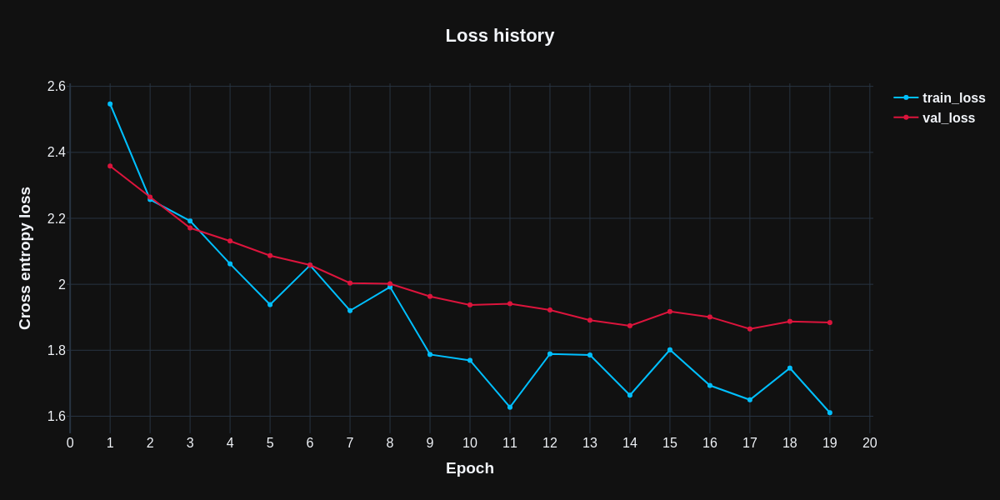
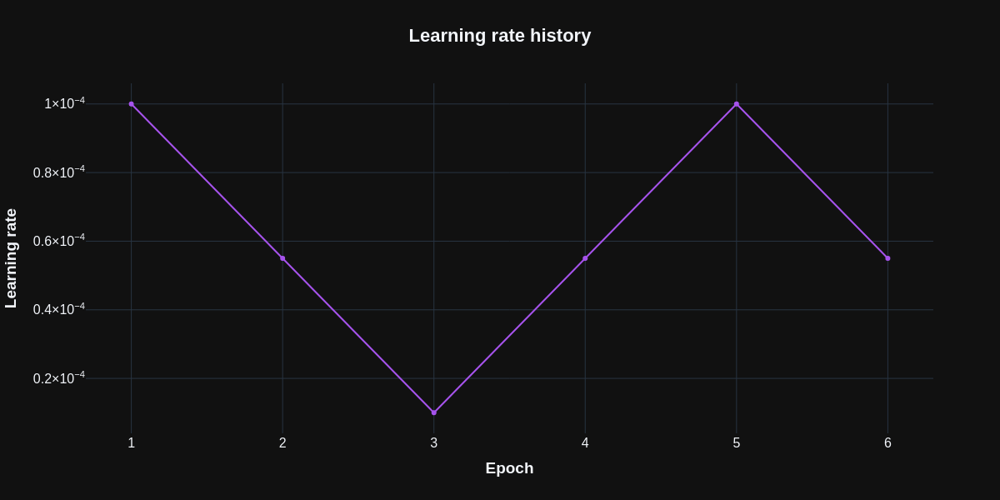

# <center>ViTSTR-Transducer implementation for text recognition</center>

<details>
  <summary><b>Example</b> (clickable spoiler)</summary>

  
  
</details>


## Architecture


## Overview
Datasets used for training can be found [<b>here</b>](https://github.com/clovaai/deep-text-recognition-benchmark) (`data_lmdb_release.zip`)

Final model size is approximately 43 MB

It took 3 epochs of training in order to achieve good results with following hyperparameters:

```yaml
d_model: 256
input_channels: 1
lr_max: 0.0001
lr_min: 1.0e-05
num_heads: 4
t_max: 2
vocab_size: 72
```

Training and inference code can be found in [<b>training.ipynb</b>](training.ipynb) and [<b>inference.ipynb</b>](inference.ipynb) respectively

  


## References
[ViTSTR-Transducer: Cross-Attention-Free Vision Transformer Transducer for Scene Text Recognition](https://www.mdpi.com/2313-433X/9/12/276)

[Text recognition (optical character recognition) with deep learning methods, ICCV 2019](https://github.com/clovaai/deep-text-recognition-benchmark)

[Vision Transformer for Fast and Efficient Scene Text Recognition](https://github.com/roatienza/deep-text-recognition-benchmark)