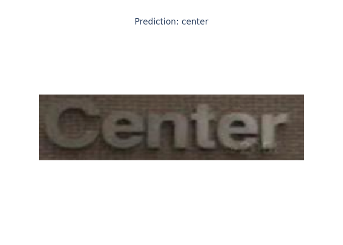
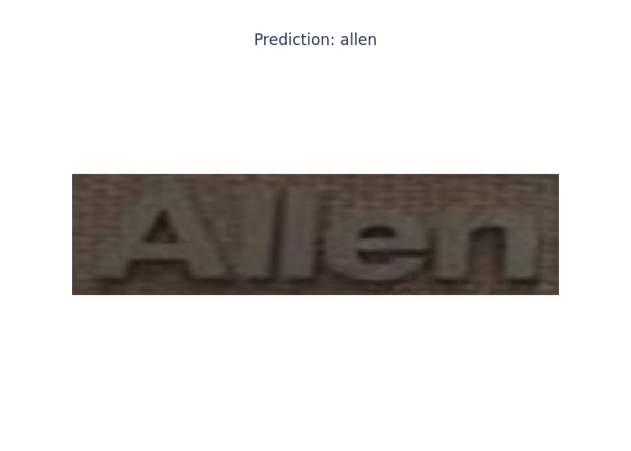
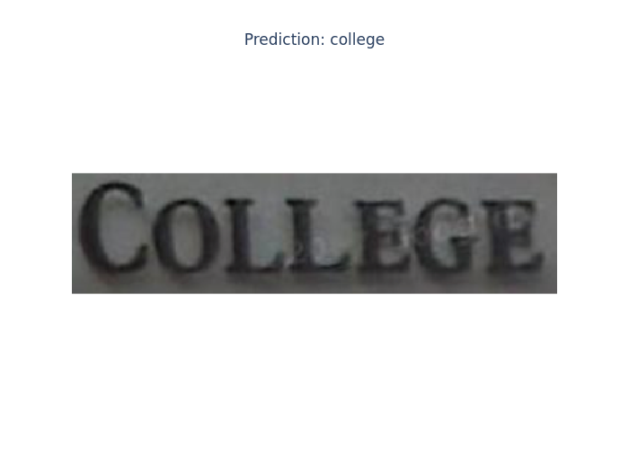
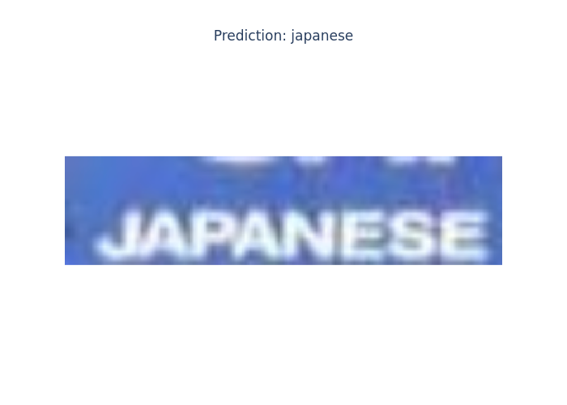
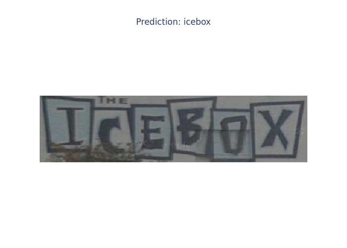
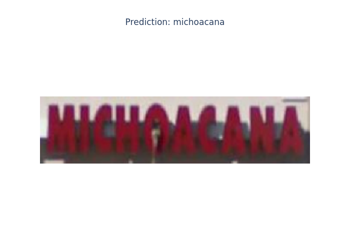
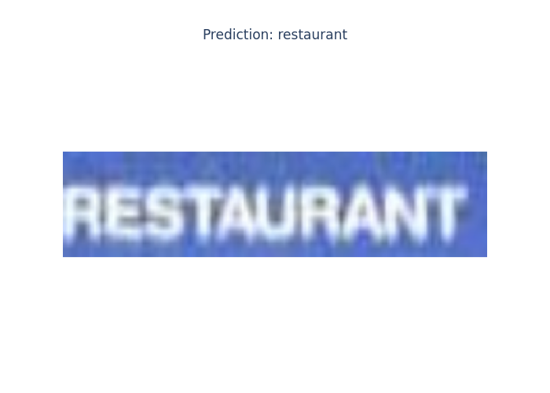
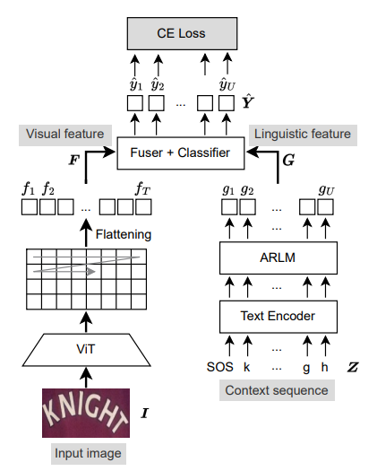

# <center>ViTSTR-Transducer implementation for text recognition</center>

<details>

  <summary><b>Test set examples</b> (clickable spoiler)</summary>
  

  
  
  
  
  
  
  
  
  
  
</details>

<b>More [here](./imgs/examples)</b>

## Architecture


## Inference using pretrained weights
## Train on your own data
`source .env && docker compose build && docker compose run vitstr`
### Dataset
Datasets can be in two different formats:
* <b>LMDB</b>

  The structure should be approximately as follows:
  ```bash
  ├── test
  │   ├── CUTE80
  │   │   ├── data.mdb
  │   │   └── lock.mdb
  │   ├── IC03_860
  │   │   ├── data.mdb
  │   │   └── lock.mdb
  │   ├── IC03_867
  │   │   ├── data.mdb
  │   │   └── lock.mdb
  │  ...
  ├── train
  │   ├── MJ
  │   │   ├── data.mdb
  │   │   └── lock.mdb
  │   └── ST
  │       ├── data.mdb
  │       └── lock.mdb
  └── val
      ├── MJ_valid
      │   ├── data.mdb
      │   └── lock.mdb
      └── extra_val
          ├── data.mdb
          └── lock.mdb
  ```
  More about lmdb internal structure can be found in [`LmdbDataset.__getitem__`](./src/data_processing/dataset.py)

* <b>JSON</b>

  ```bash
  ├── test
  │   ├── ann
  │   │   └── 1.json
  │   └── img
  │   │   └── 1.png
  ├── train
  │   ├── ann
  │   │   └── 2.json
  │   └── img
  │   │   └── 2.jpg
  └── val
      ├── ann
          └── 3.json
      └── img
          └── 3.jpeg
  ```
    
  Json file must contain 2 fields: `description` (**real target**) and `name` (**image filename without extension**)
  ```json
  {"description": "kioto", "name": "00db2bdb-a968-45b1-9e93-585dfe04042e"}
  ```

Datasets used for training, validation and testing can be found [<b>here</b>](https://github.com/clovaai/deep-text-recognition-benchmark) ([direct link to DropBox](https://www.dropbox.com/scl/fo/zf04eicju8vbo4s6wobpq/ALAXXq2iwR6wKJyaybRmHiI?rlkey=2rywtkyuz67b20hk58zkfhh2r&e=1&dl=0))


## References
[ViTSTR-Transducer: Cross-Attention-Free Vision Transformer Transducer for Scene Text Recognition](https://www.mdpi.com/2313-433X/9/12/276)

[Text recognition (optical character recognition) with deep learning methods, ICCV 2019](https://github.com/clovaai/deep-text-recognition-benchmark)

[Vision Transformer for Fast and Efficient Scene Text Recognition](https://github.com/roatienza/deep-text-recognition-benchmark)